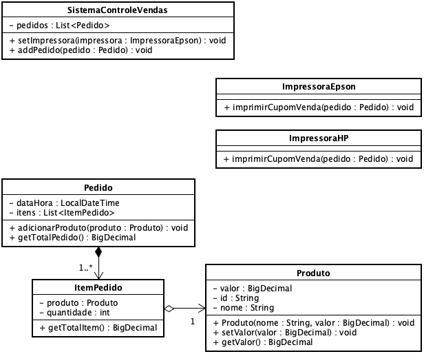

**Universidade Federal da Paraíba - UFPB** \
**Centro de Ciências Exatas e Educação - CCAE** \
**Departamento de Ciências Exatas - DCX**

**Professor:** [Rodrigo Rebouças de Almeida](http://rodrigor.dcx.ufpb.br)

# Controle de Vandas e Impressoras

O diagrama abaixo representa algumas entidades de um sistema de controle de vendas

*Seu nome:* Digite seu nome aqui  

## Questão 1 - Existe acoplamento entre SistemaControleVendas e ImpressoraEpson?
Explique.

## Questão 2 - Existe acoplamento entre SistemaControleVendas e ImpressoraHP?
Explique

## Questão 3 - Como quebrar o acoplamento entre SistemaControleVendas e as impressoras?

## Questão 4 - Altere o código de SistemaControleVendas e das impressoras de modo que o SistemaControleVendas fique desacoplado com as impressoras.

## Questão 5 - Implemente as classes Pedido, ItemPedido e Produto.

## Questão 6 - Implemente testes para a classe Produto.
  * Um produto não pode ter valor negativo.
    * Se o valor for negativo, a classe deve lançar um `IllegalArgumentException`, com a mensagem "O valor do produto não pode ser negativo"
  * Quando criado, o valor do produto é 0;

## Questão 7 - Implemente testes para a classe Pedido.
  * Quando criado, o `getTotalPedido()` deve retornar `0`;
  * Adicione alguns produtos no Pedido, com quantidades diferentes e verifique se o cálculo do total do pedido está correto.
    * Exemplo, adicione os seguintes produtos:
      * 2 Sapatos com valor 10,00
      * 3 Meias com valor 3,00
      * O total do pedido deve dar 29,00
  * Faça outros exemplos de teste.